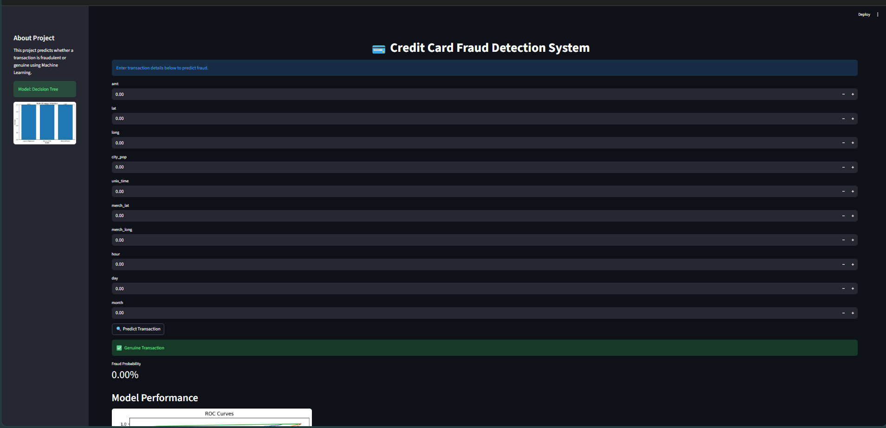

# Credit Card Fraud Detection System

## Project Overview
This project is a Machine Learning based Credit Card Fraud Detection System developed using Python, Scikit-learn, and Streamlit.

The system predicts whether a transaction is genuine or fraudulent based on transaction-related features.

## Features
- Fraud Detection
- Machine Learning Models
- Streamlit Web App
- ROC Curve Evaluation

## Technologies Used
- Python
- Pandas
- NumPy
- Scikit-learn
- Streamlit
- GitHub

## Models Used
1. Logistic Regression
2. Decision Tree
3. Random Forest

## Best Model
Random Forest achieved highest performance.

## Run Project

```bash
pip install -r requirements.txt
streamlit run app.py

## Application Demo


